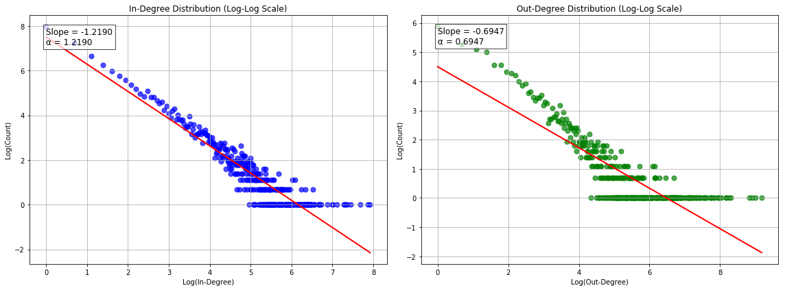
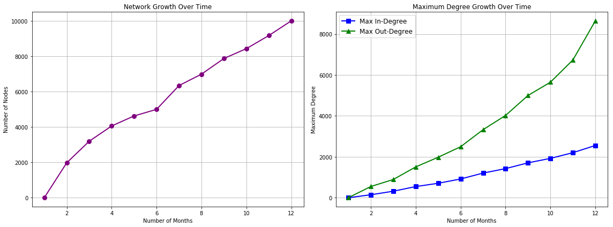
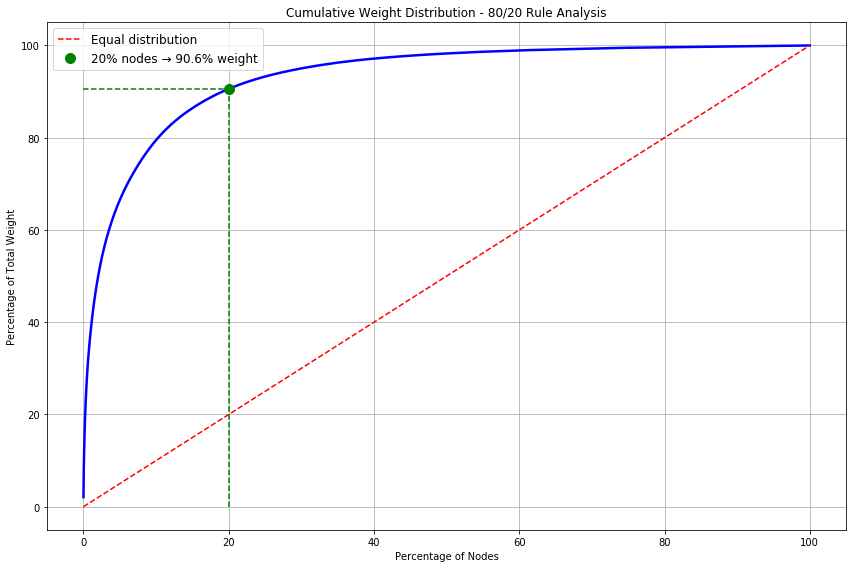

# Enron Email Network Analysis with Apache Spark


## Overview

This project applies distributed computing techniques using Apache Spark to analyze the Enron email corpus (~500,000 emails). By transforming raw email data into a weighted network representation, the project reveals communication patterns and organizational structures through network analysis algorithms implemented from scratch.

## Implementation & Technical Approach

The analysis was implemented as a series of PySpark transformations using the RDD API:

1. **Email Network Extraction**: Parses email headers to build a communication network of sender-recipient-timestamp triples
2. **Weighted Network Creation**: Aggregates emails between the same sender-recipient pairs to create a weighted directed graph
3. **Degree Analysis**: Computes in-degree and out-degree distributions to identify communication hubs
4. **Temporal Analysis**: Examines how communication patterns evolve over time

**Code Structure:**

```python
# Key functions implemented:

def extract_email_network(rdd):
    """Extract sender-recipient-timestamp triples from raw emails"""
    # Implemented with regex validation, domain filtering, and timestamp normalization
    
def convert_to_weighted_network(rdd, drange=None):
    """Create a weighted network with optional date range filtering"""
    # Implemented with aggregation of communication frequencies
    
def get_out_degrees(weighted_network_rdd):
    """Compute weighted out-degree for each node"""
    # Implemented with complete node set handling and sorting
    
def get_in_degrees(weighted_network_rdd):
    """Compute weighted in-degree for each node"""
    # Similar to out-degrees but tracking incoming connections
    
def get_out_degree_dist(weighted_network_rdd):
    """Generate distribution of out-degrees"""
    # Implemented with frequency counting of degree values
    
def get_in_degree_dist(weighted_network_rdd):
    """Generate distribution of in-degrees"""
    # Similar approach for incoming connections
    
def get_monthly_contacts(rdd):
    """Find peak communication months for each sender"""
    # Implemented with temporal aggregation and maximum finding
```

## Key Findings

The network analysis revealed several interesting properties:

### 1. Scale-Free Network Structure

The Enron email network follows a power law degree distribution (𝑝(𝑘) ∼ 𝑘^−𝛼), confirming it exhibits scale-free properties common in social networks:

- **In-degree exponent**: α = 1.2190
- **Out-degree exponent**: α = 0.6947

This indicates the presence of communication "hubs" - individuals who send or receive a disproportionately large number of emails.


*Log-log plot showing power law relationship in degree distributions with fitted slopes*

### 2. Concentration of Communication (80/20 Rule)

Analysis shows that approximately 20% of employees account for over 90% of email communication, exceeding the traditional 80/20 Pareto principle. This reveals a highly concentrated communication structure within the organization.


*Cumulative weight distribution showing 20% of nodes account for 90.6% of total communication weight*

### 3. Preferential Attachment ("Rich Get Richer")

Tracking the network's growth over time showed that maximum degree values increase linearly with node count, demonstrating the "rich get richer" phenomenon where already-connected nodes accumulate new connections at a higher rate.


*Growth of network size and maximum degree values over time showing preferential attachment*

## Performance Considerations

Implementing network analysis algorithms in a distributed environment required several optimizations:

- **Early filtering** to reduce data volume in the processing pipeline
- **Strategic partitioning** to balance workload across the cluster
- **Minimizing shuffles** by carefully ordering transformations
- **Caching intermediate RDDs** that are reused in multiple computations

## Personal Reflection

Working on this project provided valuable experience with distributed data processing and network analysis. Implementing these algorithms in Apache Spark required shifting from a sequential thinking model to a distributed paradigm, considering data locality, shuffle operations, and partition dependencies.

The scale-free properties observed in the Enron email network align with patterns seen in many other social and information networks, suggesting some universal principles in how human communication networks develop. This insight could be applied to understanding other organizational communication structures or detecting anomalous patterns.

The technical skills gained from this project - distributed computing, network analysis, and working with semi-structured data - are directly applicable to many data science challenges in professional environments.

## Dataset

The Enron email dataset contains approximately 500,000 messages exchanged by Enron employees in the late 1990s and early 2000s, made public during the SEC investigation. The dataset provides a unique opportunity to study real-world corporate communication patterns.
